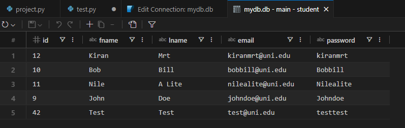
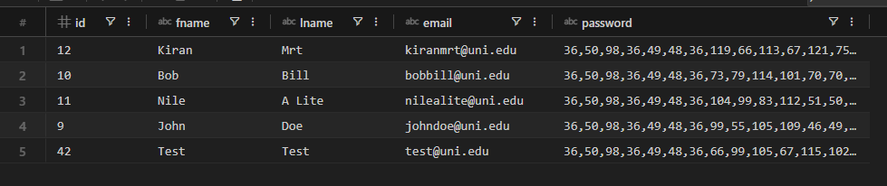

# School Management System
#### Description:
This is a school management system using python. This system differenciate users in three different roles, admin, students and lecturers, and uses sqlite3 library to make and store data.

#### Libraries used in this project
+ __venv__ - for creating virtual enviroment during development process
+ __sqlist3__ - for creating database, storing and querying data from database
+ __bcrypt__ - for encrypting passwords
+ __prettytable__ - for interface and making our output prettier
+ __pytest__ - for testing our project functions
+ __black__ - for making our code prettier and make it follow standard

#### Features
+ Admin Functions
    - adding, removing students and lecturers
    - course enrolling, withdrawing for students and lecturers 
    - viewing students and lecturer that are available in school
    - changing password
+ Student Functions
    - enrolling and withdrawing courses
    - viewing currently enrolled courses
    - changing password
+ Lecturer Functions
    - adding and removing courses
    - viewing currently teaching courses
    - changing password

#### My Experience
As it was my first python project, I learned a lot of new things, like how to create a sql database using __sqlite3__, and how do we interect with that database. I aslo learn how to do things in more __Object Oriented Programming__ way. For example, I made a student and lecturer objects and added functions, which is more useful that regular functions since student functions are bounded to student object and lecturer functions are bounded to lecturer object.\
I also learn how to store password, and how do we encrypt them. For this project I used __bcrypt__ to encrypt passwords which provide a lot of way to check and encrypt passwords.\
This is how my passwords were store before using __bcrypt__

This is after

As you can see it made a world of difference. __And I did not implement this feature till the last minute__\
I used __prettytable__ make user viewing and getting input easier. for example, if we enter the project with python project.py we will get for option like student, lecturer, admin and lecturer. If I didn't use prettytable it would have been clattered, and user will be confused. By using __prettytable__ in every part of my program, it make the user experience a lot better. I also user prettytable to show, student enrolled table, lecturer taught table and for admin to view how many people are available in the system.\
I also implemented __exitProgram()__, which make the user exit the program gracefully. Why don't I just use __sys.exit()__ ? you asked imaginary person that I created in my mind 🙂. Since we are interacting with databases it is important that we close our cursor and dbs, which will be close normally but just in case to make sure, I used __exitProgram()__. Even if we press Ctrl+C, __exitProgram()__ will be triggered and close all important things and exit the program gracefully.\ 
To get what user want to do I used match case(switch) to do each function other than doing if-else. After each function is done, user will be loop back to the option with __prettytable__, so that user wouldn't have to login again.\
While logging in, we use __bcrypt.checkpw()__ to check password. Password are stored in TEXT form of b"". When checking we, __encode()__ it back to b"" form and check it and if we are changing password, we check it, if old password is correct, new password will be hashed into b"" form and stored as TEXT.

#### Admin Credentials for Testing
admin email - __admin@uni.edu__
admin password - __Adminadmin__
